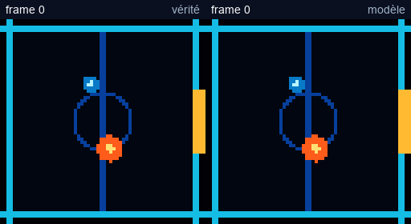
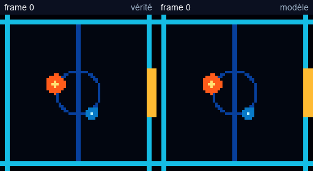
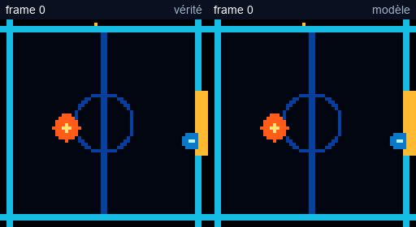
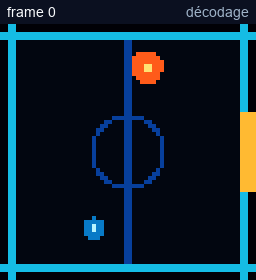

# Mesohelios A100 — recovery checkpoint at 12,000 steps

This directory contains the lightweight, reproducible results generated from the
Blocket League pixel world model trained on Mesohelios. Checkpoints and datasets
are deliberately excluded from Git because they belong in `$WORK`.

## At a glance

| Run | Training time | Final loss | Short rollout error | 64-frame error |
| --- | ---: | ---: | ---: | ---: |
| Base, 30,000 steps | 32m 47s | 0.02199 | 1.061 px | 8.306 px |
| Recovery, 12,000 steps | 13m 40s | 0.01961 | 0.968 px | 7.499 px |

Relative to the base checkpoint, recovery improves the mean position error by
8.8% on the first 12 predicted frames and 9.7% over 64 predicted frames.

## Registered truth-versus-prediction rollouts

The left lane is ground truth and the right lane is the deterministic
autoregressive prediction.

### Collision

Short errors: player 0.32 px, puck 0.53 px. Over 64 frames: player 5.74 px,
puck 8.24 px.

### Wall bounce

Short errors: player 1.00 px, puck 0.42 px. Over 64 frames: player 4.30 px,
puck 4.81 px.

### Goal and reset

Short errors: player 0.10 px, puck 0.15 px. Over 64 frames: player 2.70 px,
puck 1.86 px.

The complete 64-frame atlases and scenario metadata are in
[`rollouts/truth-vs-prediction`](rollouts/truth-vs-prediction/).

## Position restitution from one fixed latent token

Magenta marks the linearly decoded player position and cyan marks the decoded
puck position. The decoder reads only the fixed bottom-right token after block 5.

| Scenario | Player readout error | Puck readout error | Mean entity error |
| --- | ---: | ---: | ---: |
| Collision | 1.98 px | 3.34 px | 2.66 px |
| Wall bounce | 2.80 px | 1.99 px | 2.39 px |
| Goal and reset | 3.57 px | 2.75 px | 3.16 px |

The readout is compared to the positions rendered by the model itself, not to
the original simulator trajectory.

## Central analysis results

### State identification

- Player position is linearly decodable from block 1 with R² = 0.986.
- Player velocity rises from R² = 0.380 at block 1 to R² = 0.921 at block 6.
- Circular direction decoding reaches R² = 0.876 and 11.7 degrees mean error at
  block 6.
- At block 6, 41.3% of MLP units pass the direction-tuning threshold.

### Global Cartesian geometry

From one fixed bottom-right token at block 6:

- player position: R² = 0.962;
- puck position: R² = 0.967;
- transfer to an upper-right quadrant never shown to the probe: R² = 0.817 for
  the player and 0.685 for the puck.

The matched untrained transformer reaches only R² = 0.179 for the player and
0.051 for the puck on the ordinary held-out set.

### Causal latent writes

The player Jacobian directions are nearly orthogonal (cosine 0.053) and produce
an eight-direction mean angular error of 14.7 degrees, but the mean displacement
is only 0.14–0.40 px and varies substantially across initial states.

For the puck, a linear decoder direction is readable but essentially not
causal. A downstream Jacobian direction at the puck token produces the following
one-frame effects at activation strength 8:

| Write | Mean axis displacement | Expected-sign fraction | Player collateral |
| --- | ---: | ---: | ---: |
| x+ | +0.928 px | 97.7% | 0.046 px |
| x- | -0.342 px | 91.4% | 0.098 px |
| y+ | +0.436 px | 92.2% | 0.041 px |
| y- | -0.674 px | 95.3% | 0.033 px |

After a 12-frame free rollout, the puck displacement grows to between 1.07 and
2.04 px in magnitude, while total player displacement grows to 1.14–1.61 px.
This is evidence for local controllability, but not yet for a fully disentangled
player/puck input matrix.

### Collision anticipation

The raw linear pixel-trajectory baseline remains near chance. The trained block
6 probe achieves:

| Frames before impact | ROC-AUC |
| ---: | ---: |
| 1 | 0.99999 |
| 2 | 0.99966 |
| 4 | 0.99226 |
| 6 | 0.96948 |
| 8 | 0.92060 |

Positive and negative examples have matched final positions and per-object speed
magnitudes, so the probe must use the learned relational motion geometry.

## Files

- [`analysis-json/`](analysis-json/): raw central-analysis outputs.
- [`rollouts/`](rollouts/): raw atlases and manifests.
- [`views/`](views/): readable PNG contact sheets and animated GIFs.
- [`training/`](training/): benchmark, base and recovery summaries, training
  curves and evaluation rollouts.
- [`analysis-dashboard.html`](analysis-dashboard.html): the standalone
  quantitative dashboard used in the Codex report. GitHub shows its source;
  download or serve it locally to execute the charts.
- [`make_rollout_views.py`](make_rollout_views.py): script used to create the
  readable local views from the registered atlases.

## Reproduction

The cluster workflow is in
[`scripts/mesohelios/generate-restitution.sbatch`](../../scripts/mesohelios/generate-restitution.sbatch).
It uses the recovery checkpoint stored under `$WORK`, generates three registered
64-frame comparisons, three 36-frame free rollouts and three decoded-position
rollouts.
